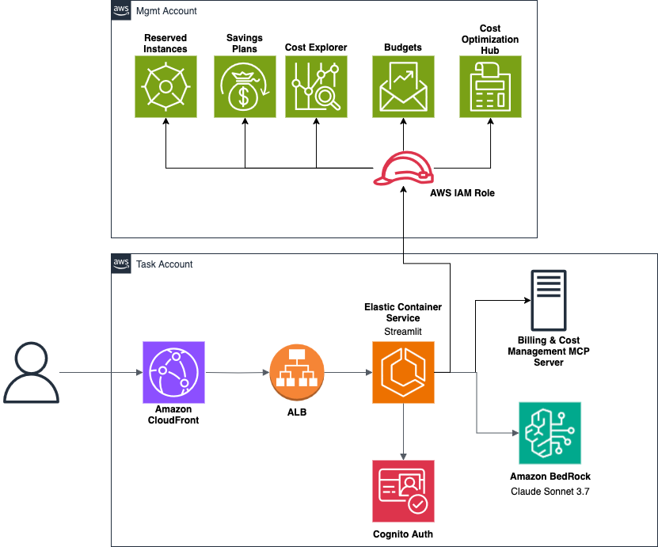

# FinOps AI Assistant

This app demonstrates how to build and deploy a comprehensive FinOps (Financial Operations) GenAI agent with a web user interface using Streamlit and AWS CDK. The agent provides intelligent AWS cost management, optimization recommendations, and cloud financial insights using dual MCP (Model Context Protocol) servers for billing analysis and AWS service investigation.

It is based on the deploy-streamlit-app sample from this repo:
https://github.com/strands-agents/samples/tree/main/04-UX-demos/01-streamlit-template

It deploys a basic Streamlit app, and contains the following components:

* The Streamlit app in [Amazon Fargate](https://aws.amazon.com/fargate/) with [ECS](https://aws.amazon.com/ecs/), behind an [Application Load Balancer](https://aws.amazon.com/elasticloadbalancing/application-load-balancer/) and [Amazon CloudFront](https://aws.amazon.com/cloudfront/)
* An [Amazon Cognito](https://aws.amazon.com/cognito/) user pool in which you can manage users

By default, the Streamlit app has the following features:

* Authentication through Cognito (deactivated by default, activate it in `docker_app/config_file.py`)
* A comprehensive FinOps AI Assistant with dual MCP servers:
  - **Billing Cost Management Server**: AWS cost analysis, budgets, Free Tier monitoring, anomaly detection

## Architecture diagram



## Prerequisites

Before deploying the FinOps AI Assistant, ensure you have the following:

### Required Software
- **Python 3.10+** (tested on Python 3.11)
- **Docker or Colima** (for local build)
- **AWS CLI** - [Installation guide](https://docs.aws.amazon.com/cli/latest/userguide/getting-started-install.html)
- **AWS CDK** - Install with `npm install -g aws-cdk`

### AWS Account Setup
- **AWS Account** with appropriate permissions to create IAM roles, ECS services, ALB, CloudFront, and Cognito
- **AWS CLI configured** with credentials (`aws configure`)
- **Bedrock model access** enabled for your chosen model:
  - Go to AWS Console → Bedrock → Model Access
  - Request access for `anthropic.claude-3-7-sonnet` or `amazon.nova-pro`
  - [Detailed instructions](https://docs.aws.amazon.com/bedrock/latest/userguide/model-access-modify.html)

## Deployment Guide

### Step 1: Configure the Application

Edit `docker_app/config_file.py` with your settings:

```python
class Config:
    # Basic configuration
    STACK_NAME = "FinOps-AI-Chatbot"  # Choose a unique name
    CUSTOM_HEADER_VALUE = "your-random-security-string-123"  # Generate a random string
    DEPLOYMENT_REGION = "us-east-1"  # Your preferred AWS region
    
    # Model configuration
    DEFAULT_BEDROCK_MODEL = "us.anthropic.claude-3-7-sonnet-20250219-v1:0"
    # Available alternatives here: https://docs.aws.amazon.com/bedrock/latest/userguide/inference-profiles-support.html
    
    # Authentication
    ENABLE_AUTH = True  # Set to False for testing without authentication. Do not deploy on AWS account without authentication
```

### Step 2: Choose Your Deployment Type

#### Option A: Same-Account Deployment (Recommended for Getting Started)

Deploy the application in the same AWS account where you want to analyze costs.

**Steps:**
1. **Install dependencies:**
   ```bash
   python -m venv .venv
   source .venv/bin/activate  # On Windows: .venv\Scripts\activate
   pip install -r requirements.txt
   ```

2. **Bootstrap CDK (first time only):**
   ```bash
   cdk bootstrap
   ```

3. **Deploy the application:**
   ```bash
   cdk deploy
   ```

4. **Note the outputs** - Save the CloudFront URL and Cognito Pool ID.

#### Option B: Cross-Account Deployment

Deploy the application in a member account but access management account billing data.

**Use Case:** Organizations with separate billing/management accounts and workload accounts.

**Steps:**

1. **In Management Account** - Deploy the cross-account role:
   ```bash
   aws cloudformation deploy \
     --template-file management-account-setup.yaml \
     --stack-name finops-chatbot-mgmt-setup \
     --parameter-overrides MemberAccountId=123456789012 \
     --capabilities CAPABILITY_IAM \
     --region us-east-1
   ```

2. **Get the role ARN:**
   ```bash
   aws cloudformation describe-stacks \
     --stack-name finops-chatbot-mgmt-setup \
     --query 'Stacks[0].Outputs[?OutputKey==`CrossAccountRoleArn`].OutputValue' \
     --output text
   ```

3. **In Member Account** - Install dependencies and deploy the application on a member account:
   ```bash
   python -m venv .venv
   source .venv/bin/activate
   pip install -r requirements.txt
   cdk bootstrap
   cdk deploy -c targetRoleArn=arn:aws:iam::MGMT-ACCOUNT-ID:role/FinOpsChatbotCrossAccountRole
   ```

### Step 3: Post-Deployment Setup

1. **Create Cognito user** (if authentication is enabled):
   - Go to AWS Console → Cognito → User Pools
   - Find your user pool (check CDK outputs for Pool ID)
   - Create user with username/password
   - Set temporary password

2. **Access the application:**
   - Open the CloudFront URL from CDK outputs
   - Login with Cognito credentials (if auth enabled)
   - Start asking FinOps questions!

**Deployment time:** 5-10 minutes


## Local Development

For development and testing, you can run the Streamlit app locally on your laptop.

### Running Locally

1. **Navigate to the app directory:**
   ```bash
   cd docker_app
   ```

2. **Create and activate virtual environment:**
   ```bash
   python -m venv .venv
   source .venv/bin/activate  # On Windows: .venv\Scripts\activate
   pip install -r requirements.txt
   ```

3. **Set environment variables** (optional):
   ```bash
   export BEDROCK_MODEL_ID="us.amazon.nova-pro-v1:0"  # Override default model
   export TARGET_ROLE_ARN="arn:aws:iam::123456789012:role/FinOpsChatbotCrossAccountRole"  # For cross-account testing
   ```

4. **Launch the Streamlit server:**
   ```bash
   streamlit run app_streaming.py --server.port 8080
   ```

5. **Open your browser** to `http://localhost:8080/`

### Local Development Notes

- **Authentication**: Set `ENABLE_AUTH = False` in `config_file.py` for local testing without Cognito
- **AWS Credentials**: Ensure your AWS CLI is configured with appropriate permissions
- **Model Access**: Your local AWS credentials must have Bedrock access
- **Cross-Account**: Use `TARGET_ROLE_ARN` environment variable for cross-account testing

## Federated Identity Setup

The FinOps AI Assistant supports federated authentication through SAML 2.0, allowing integration with external identity providers like AWS IAM Identity Center, Azure AD, Okta, and others.

### Option 1: AWS IAM Identity Center (Recommended)

AWS IAM Identity Center provides seamless integration with Cognito and supports centralized user management.

#### Prerequisites
- AWS IAM Identity Center enabled in your organization
- Administrative access to Identity Center
- Identity Center configured in a specific region (e.g., `eu-central-1`)

#### Step-by-Step Setup

**Step 1: Configure SAML in Application**

Edit `docker_app/config_file.py`:

```python
class Config:
    # ... other settings ...
    
    # SAML Federation Settings
    ENABLE_SAML_FEDERATION = True
    IDENTITY_CENTER_REGION = "eu-central-1"  # Your Identity Center region
    SAML_PROVIDER_NAME = "AWSIdentityCenter"
    
    # Leave empty initially - will be populated after Identity Center setup
    SAML_METADATA_URL = ""
    
    # Optional: Custom domain for better UX
    COGNITO_CUSTOM_DOMAIN = "finops-auth"  # Creates finops-auth.auth.{region}.amazoncognito.com
```

**Step 2: Deploy the Application**

Deploy with SAML enabled (metadata URL can be empty initially):

```bash
cdk deploy
```

**Step 3: Note CDK Outputs**

After deployment, note these important outputs:
- `SAMLEntityId`: Use as Entity ID in Identity Center
- `SAMLACSUrl`: Use as ACS URL in Identity Center
- `CognitoPoolId`: Your Cognito User Pool ID

**Step 4: Configure Identity Center Application**

1. **Go to AWS IAM Identity Center Console** (in your Identity Center region)

2. **Create a new application:**
   - Navigate to "Applications" → "Add application"
   - Choose "Add custom SAML 2.0 application"
   - Application name: `FinOps AI Assistant`

3. **Configure SAML settings:**
   - **Application ACS URL**: Use `SAMLACSUrl` from CDK output
   - **Application SAML audience**: Use `SAMLEntityId` from CDK output
   - **Application start URL**: Use your CloudFront distribution URL

4. **Configure attribute mappings:**
   ```
   ${user:email} → http://schemas.xmlsoap.org/ws/2005/05/identity/claims/emailaddress
   ${user:givenName} → http://schemas.xmlsoap.org/ws/2005/05/identity/claims/givenname
   ${user:familyName} → http://schemas.xmlsoap.org/ws/2005/05/identity/claims/surname
   ```

5. **Assign users/groups** to the application

6. **Download metadata** or copy the metadata URL

**Step 5: Update Application Configuration**

Update `docker_app/config_file.py` with the metadata URL:

```python
SAML_METADATA_URL = "https://portal.sso.eu-central-1.amazonaws.com/saml/metadata/your-app-id"
```

**Step 6: Redeploy**

```bash
cdk deploy
```

**Step 7: Test Authentication**

1. Access your CloudFront URL
2. Click "Sign in with AWS IAM Identity Center"
3. You'll be redirected to Identity Center login
4. After successful authentication, you'll be redirected back to the application

### Option 2: External SAML Identity Providers

The application supports any SAML 2.0 compliant identity provider.

#### Supported Providers
- **Azure Active Directory (Entra ID)**
- **Okta**
- **Google Workspace**
- **ADFS**
- **Ping Identity**
- **Auth0**

#### Generic SAML Setup

**Step 1: Configure Application**

```python
class Config:
    # ... other settings ...
    
    ENABLE_SAML_FEDERATION = True
    SAML_PROVIDER_NAME = "YourIdPName"  # e.g., "AzureAD", "Okta"
    SAML_METADATA_URL = ""  # Will be provided by your IdP
```

**Step 2: Deploy and Get SAML Details**

Deploy the application and note the SAML configuration outputs.

**Step 3: Configure Your Identity Provider**

Use these values in your IdP configuration:
- **Entity ID/Audience**: From `SAMLEntityId` output
- **ACS URL/Reply URL**: From `SAMLACSUrl` output
- **Name ID Format**: `urn:oasis:names:tc:SAML:2.0:nameid-format:persistent`

**Required Attribute Mappings:**
```
Email → http://schemas.xmlsoap.org/ws/2005/05/identity/claims/emailaddress
First Name → http://schemas.xmlsoap.org/ws/2005/05/identity/claims/givenname
Last Name → http://schemas.xmlsoap.org/ws/2005/05/identity/claims/surname
```

**Step 4: Update Metadata URL**

Get the SAML metadata URL from your IdP and update the configuration:

```python
SAML_METADATA_URL = "https://your-idp.com/saml/metadata"
```

**Step 5: Redeploy and Test**

### Provider-Specific Examples

#### Azure AD (Entra ID)

1. **Create Enterprise Application** in Azure AD
2. **Configure SAML SSO** with Cognito details
3. **Set up attribute mappings:**
   ```
   user.mail → http://schemas.xmlsoap.org/ws/2005/05/identity/claims/emailaddress
   user.givenname → http://schemas.xmlsoap.org/ws/2005/05/identity/claims/givenname
   user.surname → http://schemas.xmlsoap.org/ws/2005/05/identity/claims/surname
   ```
4. **Get Federation Metadata URL** from Azure AD

#### Okta

1. **Create SAML 2.0 App** in Okta Admin Console
2. **Configure SAML Settings** with Cognito details
3. **Set up attribute statements:**
   ```
   email → http://schemas.xmlsoap.org/ws/2005/05/identity/claims/emailaddress
   firstName → http://schemas.xmlsoap.org/ws/2005/05/identity/claims/givenname
   lastName → http://schemas.xmlsoap.org/ws/2005/05/identity/claims/surname
   ```
4. **Get Identity Provider metadata** URL

### Troubleshooting Federation

#### Common Issues

**SAML Response Validation Errors:**
- Verify attribute mappings match exactly
- Check that the metadata URL is accessible
- Ensure clock synchronization between IdP and AWS

**User Not Found Errors:**
- Verify email attribute is being sent correctly
- Check Cognito User Pool settings for auto-user creation

**Redirect Loop Issues:**
- Verify ACS URL matches exactly (including https://)
- Check that the Entity ID is correctly configured

#### Testing Federation

1. **Use Cognito Hosted UI** for testing:
   ```
   https://your-domain.auth.region.amazoncognito.com/login?client_id=your-client-id&response_type=code&scope=email+openid+profile&redirect_uri=https://your-cloudfront-url/
   ```

2. **Check CloudWatch Logs** for authentication errors

3. **Verify SAML Response** using browser developer tools

### Security Considerations

- **Use HTTPS** for all SAML endpoints
- **Validate certificates** in production environments
- **Configure session timeouts** appropriately
- **Enable MFA** in your identity provider when possible
- **Regularly rotate** SAML signing certificates

## Modify this sample to build your own agent

To build your own agent, edit the `docker_app/app_streaming.py` file. The key areas you'll want to focus on are:

1. The agent configuration - Look for the `agent = Agent(...)` initialization
2. The UI elements defined using Streamlit components


### Sample queries

The application includes comprehensive sample queries organized by category:

**🆓 Free Tier & Budget Management:**
- "Show me my AWS Free Tier usage status"
- "How are my budgets performing this month?"

**💰 Cost Analysis & Forecasting:**
- "Show me my AWS costs for the last 30 days"
- "What are my top 5 most expensive services?"
- "Compare my costs from last month to this month"

**⚡ Optimization & Recommendations:**
- "Give me rightsizing recommendations for my EC2 instances"
- "What Compute Optimizer recommendations do I have?"
- "Which instances are good candidates for Graviton migration?"

**🔧 Service Configuration & Investigation:**
- "Show me details about my EC2 instances"
- "What are the configurations of my RDS databases?"
- "List all my S3 buckets and their properties"

See the full list of sample queries in the application's expandable help section.

## Troubleshooting

### Common Configuration Issues

#### Model Access Issues
- **Error**: "Access denied to Bedrock model"
- **Solution**: Ensure the model is enabled in your AWS account's Bedrock console
- **Check**: Go to AWS Console → Bedrock → Model Access → Request access for required models

#### Cross-Account Role Issues
- **Error**: "Unable to assume role"
- **Solution**: Verify the trust policy in the management account role includes your ECS task role ARN
- **Check**: Use the `TaskRoleArn` output from CDK deployment

#### Authentication Issues
- **Error**: Cognito authentication failures
- **Solution**: Check callback URLs match your CloudFront distribution domain
- **Check**: Cognito User Pool Client settings include correct redirect URIs

#### SAML Federation Issues
- **Error**: SAML authentication not working
- **Solution**: Verify Identity Center metadata URL is correct and accessible
- **Check**: Ensure attribute mappings are configured correctly in Identity Center

#### Stack Recreation Issues
- **Error**: "Secret already exists" when recreating stack
- **Solution**: Update `SECRETS_MANAGER_ID` in config_file.py with a new value
- **Reason**: AWS Secrets Manager has a retention period for deleted secrets

### Performance Optimization

#### Container Resources
Default configuration uses:
- **Memory**: 2048 MiB
- **CPU**: 1024 units (1 vCPU)

For high-traffic deployments, consider increasing these values in `cdk_stack.py`:

```python
fargate_task_definition = ecs.FargateTaskDefinition(
    self,
    f"{prefix}WebappTaskDef",
    memory_limit_mib=4096,  # Increase for better performance
    cpu=2048,               # Increase for better performance
)
```
